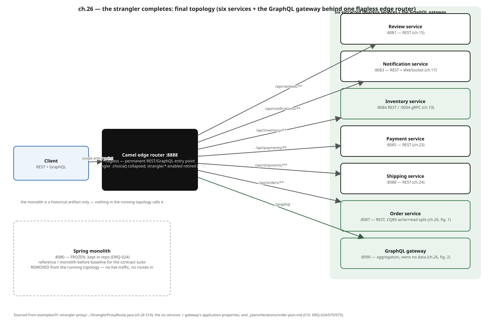

# Modernizing Enterprise Applications


A **runnable, chapter-by-chapter account of strangling a Spring Boot monolith
into Quarkus + Camel microservices** — one seam at a time, with a
behavior-equivalence suite green at every step, driven throughout by an **AI
Development Lifecycle (ADLC)**.

**[Read the tutorial](https://patterncatalyst.github.io/modernizing-enterprise-applications/)**

It serves two purposes at once:

1. **A modernization playbook.** It walks the microservices decomposition
   patterns — the strangler fig, anti-corruption layers, database-per-service,
   the transactional outbox, CDC, sagas, CQRS — in the incremental,
   strangler-first spirit of Sam Newman's *Monolith to Microservices*,
   cross-referenced against the wider pattern catalog, as a *running* migration,
   not a slide deck. A deliberately smelly six-context
   monolith is taken apart into six owned services, each extraction proven
   behavior-equivalent against the monolith before its old module is
   decommissioned.
2. **The ADLC in practice.** Every migration chapter carries an "ADLC in
   Action" trace — Frame, Plan, Generate, Verify, Reconcile — showing how the
   work was actually driven by agents, skills, and MCP tools, with the
   behavior-equivalence suite as the safety net that makes agent-generated
   change safe to merge.

## The journey at a glance

A fresh Spring Boot monolith (`examples/00-monolith`) ships with **six bounded
contexts** — `order`, `inventory`, `payment`, `shipping`, `notification`,
`review` — sharing one schema, with deliberately planted smells each pattern
later cures. A Camel **strangler proxy** (`examples/01-strangler-proxy`) sits in
front of it, and over six extractions each context is lifted onto Quarkus,
given its own data, cut over behind a feature flag, and the monolith module
retired:

| # | Extraction | Seam / pattern | Service |
|---|---|---|---|
| 1 | Review | Strangler fig, first seam (walking skeleton) | `examples/02-review-service` |
| 2 | Notification | Async, transactional outbox → Kafka | `examples/03-notification-service` |
| 3 | Inventory | gRPC seam, CDC backfill (Debezium, transition-only) | `examples/04-inventory-service` |
| 4 | Payment | Choreographed saga | `examples/05-payment-service` |
| 5 | Shipping | Orchestrated saga (Camel Saga EIP) | `examples/06-shipping-service` |
| 6 | Order | CQRS write/read split; the monolith is decommissioned | `examples/07-order-service` |

A **GraphQL aggregation gateway** (`examples/08-graphql-gateway`) then federates
the services into one composed query surface, and an **Avro + Apicurio schema
registry demonstrator** (`examples/09-schema-registry-demo`) shows contract-first
event evolution. By the end, the monolith is frozen in-repo and every context is
sole owner of its data — the strangler fig has fully grown over.



## Quickstart

```bash
# Clone
gh repo clone patterncatalyst/modernizing-enterprise-applications
cd modernizing-enterprise-applications

# Start the local stack (Postgres, Kafka KRaft, LGTM observability)
cp .env.example .env
./scripts/stack-up.sh

# Run the reference monolith
cd examples/00-monolith && mvn spring-boot:run     # :8080

# Run an extracted Quarkus service in dev mode
cd examples/02-review-service && mvn quarkus:dev
```

The dev substrate is **Docker Engine** (`docker-ce`, docker context `default`)
with the **`docker compose` v2 plugin**, on a Fedora or RHEL host — one
`compose.yaml` source, the same image pins CI uses. Docker Desktop is never
required. A local **minikube** cluster (docker driver, containerd runtime) is
used only for the Kubernetes-native chapters (service mesh, observability,
deployment), and OpenShift Local (CRC) only for the OpenShift appendix — one
local cluster at a time. See
[Prerequisites](https://patterncatalyst.github.io/modernizing-enterprise-applications/docs/01-prerequisites/)
for full environment setup.

Testcontainers and Quarkus Dev Services find Docker Engine on
`/var/run/docker.sock` with no extra configuration (no `DOCKER_HOST` export).

| Path | Bring-up | Reach it |
|---|---|---|
| Compose (daily dev, demos) | `./scripts/stack-up.sh` | Grafana `localhost:3000`, Prometheus `localhost:19090` (Cockpit owns 9090) |
| minikube (ch. 29–30) | `deploy/k8s/scripts/setup-profile.sh` → `install-istio.sh` → `build-images.sh` → `deploy.sh` | edge `127.0.0.1:30888`, Grafana `127.0.0.1:30300` (NodePorts published at profile creation) |
| OpenShift Local (appendix) | `openshift/mirror-infra-images.sh` → `build-images.sh` → `deploy.sh` | Routes on `*.apps-crc.testing` |

## The behavior-equivalence suite

The spine of the whole migration is a **Newman/Postman collection** that asserts
the *observable behavior* of the system — every extraction must keep it green,
through the strangler proxy, before the monolith module it replaces is
decommissioned.

```bash
./demos/demo-equivalence.sh        # run the suite against the current topology
./demos/demo-cutover.sh            # flag-flip a seam and prove equivalence holds
./demos/demo-final-topology.sh     # the end-state: all six contexts extracted
```

GitHub Actions runs the same suite as a per-seam **equivalence gate** (and a
contract gate for the order/gateway seam) on every push — see
`.github/workflows/code-ci.yml`. The site is built and published by
`.github/workflows/pages.yml`.

## Runnable examples

| Example | Demonstrates | Chapters |
|---------|--------------|----------|
| `examples/00-monolith` | Spring Boot 4.1 monolith (frozen shell; built on 3.5), six bounded contexts, six tagged smells, three-tier JUnit tests | Part 3 (ch. 8–10) |
| `examples/01-strangler-proxy` | Camel strangler proxy, flag-gated routing, the equivalence suite through the proxy | Part 5 (ch. 14–16) |
| `examples/02-review-service` | First extraction; two-phase Spring→Quarkus migration (lift via Spring-compat, then idiomatic) | ch. 15 |
| `examples/03-notification-service` | Async extraction; transactional outbox → Kafka, SmallRye consumer, WebSocket push | ch. 17 |
| `examples/04-inventory-service` | gRPC seam; CDC backfill with Debezium (transition-only, retired at cutover) | ch. 19 |
| `examples/05-payment-service` | Choreographed saga over Kafka; compensation via choreography | ch. 23 |
| `examples/06-shipping-service` | Orchestrated saga with the Camel Saga EIP; compensation flow | ch. 24 |
| `examples/07-order-service` | CQRS write/read split; the monolith is decommissioned | ch. 26 |
| `examples/08-graphql-gateway` | SmallRye GraphQL aggregation gateway federating all six services | ch. 26 |
| `examples/09-schema-registry-demo` | Avro + Apicurio 3 schema registry, contract-first event evolution | ch. 28 |

Each example has its own `README.md` covering what it does and how to drive it.
Extracted services run with `mvn quarkus:dev`; the monolith with
`mvn spring-boot:run`.

## Tutorial structure

Eleven parts (**Part 0** through **Part 10**), 33 chapters:

| Part | Topic |
|------|-------|
| 0 | Setting Up — introduction, prerequisites, the project ledger |
| 1 | Why Modernize — the case, the microservice traits, the 2026 evolution arc |
| 2 | The ADLC — from SDLC to ADLC; agents, skills & MCP tools; the ADLC safety net |
| 3 | The Reference Monolith — the six contexts and their deliberate smells |
| 4 | Finding the Seams — event storming, bounded contexts, the coupling ladder |
| 5 | The Strangler Fig in Practice — the pattern, Review extraction, content-based routing + ACL |
| 6 | Data Across the Seam — owned data, outbox done right, event sourcing & CQRS, ACID→ACD |
| 7 | Coordinating Across Services — CDC, choreographed & orchestrated sagas, resilience |
| 8 | Communication & Contracts — the Quarkus/MicroProfile chassis, Avro + the service registry |
| 9 | Operating the Modernized System — deployment patterns, mesh, observability & tracing |
| 10 | Delivering & Reflection — CI/CD, GitOps, supply chain; the pattern language revisited |

## Stack

| Component | Role |
|-----------|------|
| JDK 25 (SDKMAN) | Language runtime |
| Quarkus 3.40.1 | Target runtime (fast startup, Dev Services, native builds) |
| Spring Boot 4.1.1 | The reference monolith ("before") |
| Apache Camel 4.22.1 (Camel Quarkus 3.40.0, via the Quarkus 3.40.1 platform) | Strangler proxy, orchestrated saga (Java DSL) |
| Apache Kafka (KRaft) `4.3.1` | Event backbone (outbox relays, saga choreography) |
| PostgreSQL 18.6 | Persistent storage, per-service schemas, the outbox |
| Apicurio Registry 3.3.3 | Avro schema registry (contract-first events) |
| Debezium Connect 3.7.0.Final | CDC backfill during the inventory cutover (transition-only) |
| Docker Engine + `docker compose` | Local container engine for every path (Fedora/RHEL hosts) |
| minikube 1.39 / Kubernetes v1.36.5 | Cluster for the Kubernetes chapters (docker driver, containerd) |
| Istio 1.31.1 | Service mesh / mTLS / tracing (minikube chapters) |
| `grafana/otel-lgtm` 0.36.0 | Observability (Grafana + Loki + Tempo + Prometheus + OpenTelemetry Collector) |
| UBI 10 (`ubi10/openjdk-25-runtime:1.24-15`) | Application base images |
| Newman / Postman | The behavior-equivalence suite |

## Repo map

```
examples/        — the monolith, the strangler proxy, and the ten runnable
                    services/demonstrators (00-monolith … 09-schema-registry-demo)
demos/           — demo-*.sh scripts: equivalence, per-seam cutovers, final topology
deploy/k8s/      — kustomize base + minikube overlay, Istio, LGTM observability,
                    and scripts/ for the minikube profile, images and deploy
openshift/       — OpenShift Local appendix: Helm chart + build/deploy/teardown scripts
scripts/         — local stack up/down, Debezium register/retire, CDC verify,
                    and the diagram generator
assets/diagrams/ — paired SVG + Excalidraw figures (one generator per figure)
compose.yaml     — the single docker compose source (dev + CI substrate)
_docs/           — the tutorial chapters (Jekyll docs collection)
_parts/          — the eleven parts
_plans/          — build plan, decisions log (DRQ-NNN), reconciliation log
```

## License

Apache License 2.0 — see [`LICENSE`](LICENSE).
</content>
</invoke>
